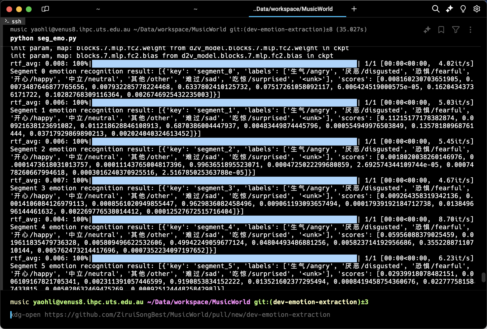

In this week, I tested and developed some functions related to multimodal emotion analysis. 

[FunASR](https://github.com/modelscope/FunASR/tree/main) is a project for multiple speech recognition tools. We used the emotion2vec model within this toolkit, and wrote a preliminary testing code for analyzing emotion in the audio.

[VaianiLorenzo/ViPER-VTF](https://github.com/VaianiLorenzo/ViPER) can also be a potential choice for various input and perform analysis.

And we are working on more testing on possible inputs under our app scenario.

